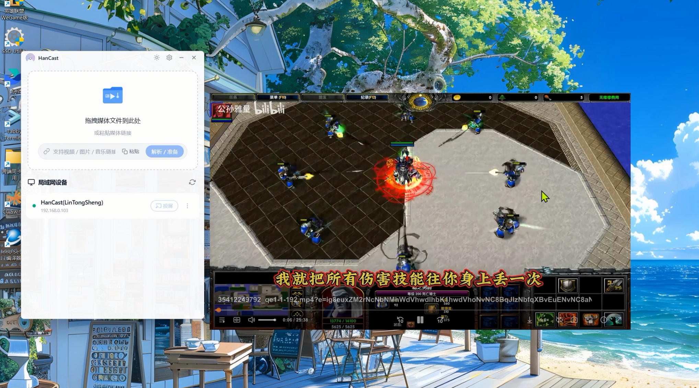
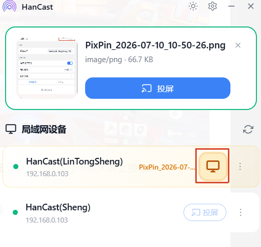

<p align="center">
  <a href="README.md"></a>
  <a href="README_en.md"></a>
</p>

<p align="center">
  
</p>

<h1 align="center">HanCast</h1>

<p align="center">
  <strong>跨平台无线投屏与接收端应用</strong>
</p>

<p align="center">
  开源跨平台投屏工具 — 拖拽文件到电视，手机投屏到电脑，一步到位。
</p>

<p align="center">
  
  
</p>

<p align="center">
  <a href="https://apps.microsoft.com/detail/9nk1xwpg6hd5?launch=true&mode=mini">
    
  </a>
</p>

<p align="center">
  
</p>

<p align="center">
  
</p>

---

## 功能特性

### 发送投屏

拖拽文件或粘贴链接，选择设备，一键投屏。

| 媒体源 | 操作 | 示例 |
|--------|------|------|
| **本地文件** | 拖拽视频 / 音频 / 图片到窗口 | `.mp4` `.mp3` `.jpg` |
| **网络链接** | 粘贴 HTTP / HTTPS 直链 | `https://example.com/video.mp4` |
| **B站视频** | 粘贴 B站链接，自动解析取流 | `bilibili.com/video/BV...` |
| **剪贴板** | 复制链接后直接粘贴 | — |

### 接收投屏


电脑化身 DLNA 接收端。手机上爱奇艺、B站等 App 的投屏按钮，点一下就能在电脑大屏上播放。

- 底层搭载 MPV 播放器，几乎支持所有媒体格式
- 接收到投屏请求时自动启动播放，能够记住上次窗口位置跟大小

### 投屏控制


投屏启动后，点击设备卡片打开控制面板：

- 实时预览媒体封面与标题
- 音量调节+进度调节
- 一键停止投屏
#### 多设备投屏控制



- 可以同时给不同设备投屏，并且保持控制器状态  

### 投屏安全


- **投屏确认** — 未知设备投屏时弹窗确认，防止误投
- **超时自动拒绝** — 15 秒内未操作则自动拒绝（时长可配置）
- **信任管理** — 支持「允许一次」或「始终允许」，信任设备下次不再询问

## 下载应用

  | 平台 | 链接 |
  |------|------|
  [GitHub Releases](https://github.com/lanzeweie/HanCast/releases/latest) | [https://github.com/lanzeweie/HanCast/releases/latest](https://github.com/lanzeweie/HanCast/releases/latest)
  [Gitee Releases](https://gitee.com/buxiangqumingzi/han-cast/releases/latest) | [https://gitee.com/buxiangqumingzi/han-cast/releases/latest](https://gitee.com/buxiangqumingzi/han-cast/releases/latest)
---

## 开发者快速开始

### 前置依赖

| 依赖 | 版本 | 说明 |
|------|------|------|
| [Node.js](https://nodejs.org/) | >= 18 | 前端构建 |
| [Rust](https://rustup.rs/) | 最新 stable | Tauri 构建 |
| [Python](https://python.org/) | >= 3.11 | 后端运行 |
| [uv](https://docs.astral.sh/uv/) | 最新 | Python 包管理（推荐） |
| [MPV](https://mpv.io/) | 任意 | 接收投屏需要，发送投屏可选 |

### 安装与运行

```bash
# 克隆仓库
git clone https://github.com/your-username/HanCast.git
cd HanCast

# 安装依赖
npm install
cd hancast-backend && uv sync && cd ..

# 启动开发模式（前端 + Rust + Python 一键启动）
npm run tauri dev
```

**仅前端开发**（浏览器 mock 模式，无需 Python / Rust）：

```bash
npm run dev
# 浏览器访问 http://localhost:1420
```

**仅 Python 后端调试**：

```bash
cd hancast-backend
uv run python -m hancast_sidecar.main
```

### 生产构建

```bash
npm run tauri build
```

构建产物位于 `src-tauri/target/release/bundle/`（MSI / NSIS 安装包）。

> ⚠️ 直接运行 `hancast.exe` 会闪退 — 它依赖 Python Sidecar。开发测试请用 `npm run tauri dev`。

---

## 技术架构

```
┌─────────────────┐     invoke()     ┌─────────────────┐
│  Vue 3 前端      │ ──────────────→ │  Rust Tauri      │
│  (WebView)       │ ←────────────── │  (SidecarManager)│
└─────────────────┘     Promise      └────────┬────────┘
                                              │ stdin/stdout JSON
                                              ▼
                                     ┌─────────────────┐
                                     │  Python Sidecar  │
                                     │  (DLNA/SSDP/MPV) │
                                     └─────────────────┘
```

| 层级 | 技术 | 职责 |
|------|------|------|
| 前端 | Tauri 2.0 + Vue 3 + TypeScript + Pinia | UI 渲染、用户交互、状态管理 |
| 桥接 | Rust (Tauri Commands) | 进程管理、Sidecar 生命周期、IPC |
| 后端 | Python 3.11+ (Sidecar) | DLNA 协议、SSDP 发现、媒体服务 |
| 播放器 | MPV (外部依赖) | 媒体播放、IPC 控制 |

前端通过 Tauri `invoke()` 调用 Rust 命令，Rust 通过 stdin/stdout JSON 与 Python Sidecar 通信。

---

## 项目结构

```
HanCast/
├── src/                        # Vue 3 前端
│   ├── components/             # UI 组件
│   │   ├── TitleBar.vue        # 自定义标题栏
│   │   ├── MediaInput.vue      # 媒体输入（拖拽/链接/粘贴）
│   │   ├── DeviceList.vue      # 设备列表
│   │   ├── DeviceCard.vue      # 设备卡片（投屏/重命名/移除）
│   │   └── CastController.vue  # 投屏控制栏
│   ├── stores/                 # Pinia 状态管理
│   ├── locales/                # 国际化资源
│   └── api/commands.ts         # Tauri invoke 封装
│
├── src-tauri/                  # Rust Tauri 壳层
│   ├── src/
│   │   ├── lib.rs              # 20 个 Tauri 命令定义
│   │   └── sidecar.rs          # SidecarManager（Rust ↔ Python）
│   └── Cargo.toml
│
├── hancast-backend/            # Python 后端
│   └── hancast_sidecar/
│       ├── main.py             # Sidecar 入口（stdin/stdout JSON 循环）
│       ├── commands.py         # 命令路由（20 个命令）
│       ├── ssdp.py             # SSDP 设备发现
│       ├── protocol/
│       │   ├── dlna.py         # DLNA 协议实现
│       │   └── server.py       # DLNA HTTP 服务
│       ├── renderer/
│       │   └── mpv.py          # MPV 渲染器（IPC 控制）
│       ├── media/
│       │   ├── parser.py       # 媒体文件/URL 解析
│       │   ├── bili_resolver.py # B站视频解析
│       │   └── server.py       # 本地文件 HTTP 服务 + 代理
│       └── xml/                # UPnP 描述文件
│
└── docs/                       # 设计文档
```

---

## 开发文档

| 文档 | 说明 |
|------|------|
| [CLAUDE.md](CLAUDE.md) | 项目指南与开发约束 |
| [前端设计规格](docs/Macast-Frontend-Spec.md) | UI 组件、样式、路由设计 |
| [后端设计规格](docs/HanCast-Backend-Spec.md) | Rust/Python 架构、通信协议 |
| [前端 API 接口](docs/Macast-Frontend-API.md) | 20 个 invoke 命令速查 |

---

## 许可证

[GPL-3.0](LICENSE) © 2024-2026 [lanzeweie](https://github.com/lanzeweie)

基于 [xfangfang/Macast](https://github.com/xfangfang/Macast) 二次开发，继承原项目协议。

## 致谢

- [xfangfang/Macast](https://github.com/xfangfang/Macast) — 原始项目
- [Tauri](https://tauri.app/) — 跨平台桌面应用框架
- [akFace/mpv.config](https://github.com/akFace/mpv.config) — MPV 主题皮肤（modernz）
