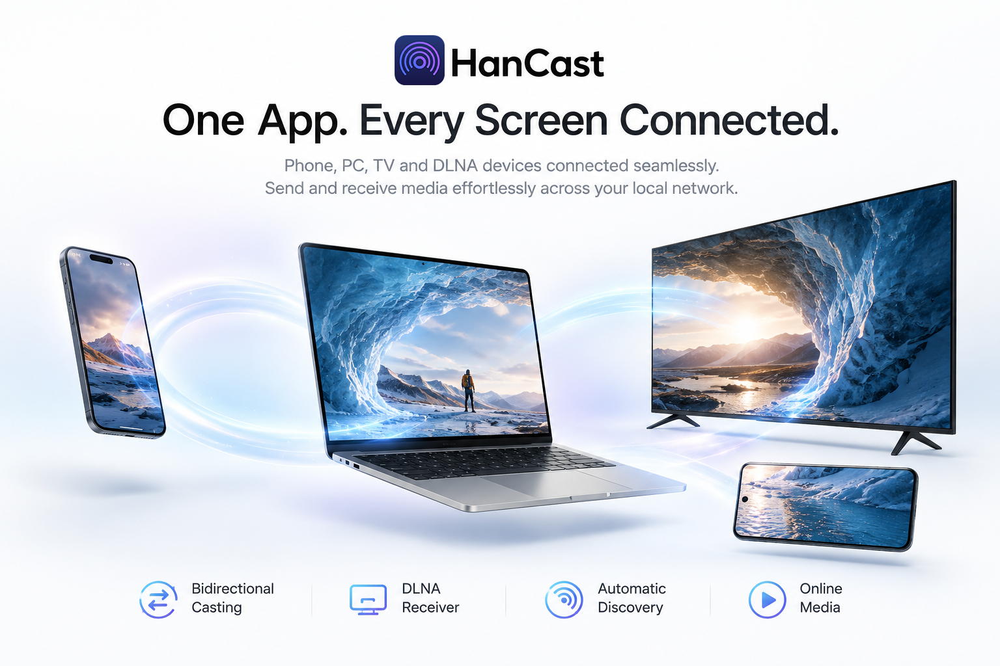

<p align="center">
  <a href="README.md"></a>
  <a href="README_en.md"></a>
</p>

<p align="center">
  
</p>

<h1 align="center">HanCast</h1>

<p align="center">
  <strong>Cross-Platform Wireless Casting & Receiver App</strong>
</p>

<p align="center">
  Open-source cross-platform casting tool — drag files to your TV, cast from phone to PC, all in one step.
</p>

<p align="center">
  
  
</p>

<p align="center">
  <a href="https://apps.microsoft.com/detail/9nk1xwpg6hd5?launch=true&mode=mini">
    
  </a>
</p>

<p align="center">
  
</p>

<p align="center">
  
</p>

---

## Features

### Send Cast

Drag a file or paste a link, select a device, and cast in one click.

| Media Source | Action | Example |
|--------------|--------|---------|
| **Local Files** | Drag video / audio / image to the window | `.mp4` `.mp3` `.jpg` |
| **Online Links** | Paste HTTP / HTTPS direct links | `https://example.com/video.mp4` |
| **Bilibili Videos** | Paste Bilibili links, auto-resolve streams | `bilibili.com/video/BV...` |
| **Clipboard** | Copy a link and paste directly | — |

### Receive Cast


Turn your PC into a DLNA receiver. Tap the cast button in apps like iQIYI or Bilibili on your phone, and it plays instantly on your PC's big screen.

- Powered by MPV player, supporting virtually all media formats
- Auto-starts playback when a cast request arrives; remembers window position and size

### Cast Control


After casting starts, click the device card to open the control panel:

- Real-time media cover and title preview
- Volume and progress control
- One-click stop cast

#### Multi-Device Cast Control


- Cast to multiple devices simultaneously while maintaining independent controller states

### Cast Security


- **Cast Confirmation** — Popup confirmation for unknown device cast requests to prevent accidental casting
- **Timeout Auto-Reject** — Automatically rejects after 15 seconds of inactivity (configurable)
- **Trust Management** — Supports "Allow Once" or "Always Allow"; trusted devices won't prompt again

## Download

| Platform | Link |
|----------|------|
| [GitHub Releases](https://github.com/lanzeweie/HanCast/releases/latest) | [https://github.com/lanzeweie/HanCast/releases/latest](https://github.com/lanzeweie/HanCast/releases/latest) |
| [Gitee Releases](https://gitee.com/buxiangqumingzi/han-cast/releases/latest) | [https://gitee.com/buxiangqumingzi/han-cast/releases/latest](https://gitee.com/buxiangqumingzi/han-cast/releases/latest) |

---

## Quick Start for Developers

### Prerequisites

| Dependency | Version | Notes |
|------------|---------|-------|
| [Node.js](https://nodejs.org/) | >= 18 | Frontend build |
| [Rust](https://rustup.rs/) | Latest stable | Tauri build |
| [Python](https://python.org/) | >= 3.11 | Backend runtime |
| [uv](https://docs.astral.sh/uv/) | Latest | Python package manager (recommended) |
| [MPV](https://mpv.io/) | Any | Required for receive casting; optional for send casting |

### Install & Run

```bash
# Clone the repo
git clone https://github.com/your-username/HanCast.git
cd HanCast

# Install dependencies
npm install
cd hancast-backend && uv sync && cd ..

# Start dev mode (frontend + Rust + Python all-in-one)
npm run tauri dev
```

**Frontend only** (browser mock mode, no Python/Rust needed):

```bash
npm run dev
# Open http://localhost:1420 in browser
```

**Python backend debugging only**:

```bash
cd hancast-backend
uv run python -m hancast_sidecar.main
```

### Production Build

```bash
npm run tauri build
```

Build output is located at `src-tauri/target/release/bundle/` (MSI / NSIS installers).

> ⚠️ Running `hancast.exe` directly will crash — it depends on the Python Sidecar. Use `npm run tauri dev` for development testing.

---

## Architecture

```
┌─────────────────┐     invoke()     ┌─────────────────┐
│  Vue 3 Frontend  │ ──────────────→ │  Rust Tauri      │
│  (WebView)       │ ←────────────── │  (SidecarManager)│
└─────────────────┘     Promise      └────────┬────────┘
                                              │ stdin/stdout JSON
                                              ▼
                                     ┌─────────────────┐
                                     │  Python Sidecar  │
                                     │  (DLNA/SSDP/MPV) │
                                     └─────────────────┘
```

| Layer | Tech | Responsibility |
|-------|------|----------------|
| Frontend | Tauri 2.0 + Vue 3 + TypeScript + Pinia | UI rendering, user interaction, state management |
| Bridge | Rust (Tauri Commands) | Process management, Sidecar lifecycle, IPC |
| Backend | Python 3.11+ (Sidecar) | DLNA protocol, SSDP discovery, media services |
| Player | MPV (external dependency) | Media playback, IPC control |

The frontend calls Rust commands via Tauri `invoke()`, and Rust communicates with the Python Sidecar via stdin/stdout JSON.

---

## Project Structure

```
HanCast/
├── src/                        # Vue 3 Frontend
│   ├── components/             # UI Components
│   │   ├── TitleBar.vue        # Custom title bar
│   │   ├── MediaInput.vue      # Media input (drag/link/paste)
│   │   ├── DeviceList.vue      # Device list
│   │   ├── DeviceCard.vue      # Device card (cast/rename/remove)
│   │   └── CastController.vue  # Cast control bar
│   ├── stores/                 # Pinia state management
│   ├── locales/                # i18n resources
│   └── api/commands.ts         # Tauri invoke wrapper
│
├── src-tauri/                  # Rust Tauri Shell
│   ├── src/
│   │   ├── lib.rs              # 20 Tauri command definitions
│   │   └── sidecar.rs          # SidecarManager (Rust ↔ Python)
│   └── Cargo.toml
│
├── hancast-backend/            # Python Backend
│   └── hancast_sidecar/
│       ├── main.py             # Sidecar entry (stdin/stdout JSON loop)
│       ├── commands.py         # Command router (20 commands)
│       ├── ssdp.py             # SSDP device discovery
│       ├── protocol/
│       │   ├── dlna.py         # DLNA protocol implementation
│       │   └── server.py       # DLNA HTTP server
│       ├── renderer/
│       │   └── mpv.py          # MPV renderer (IPC control)
│       ├── media/
│       │   ├── parser.py       # Media file/URL parsing
│       │   ├── bili_resolver.py # Bilibili video resolver
│       │   └── server.py       # Local file HTTP server + proxy
│       └── xml/                # UPnP description files
│
└── docs/                       # Design docs
```

---

## Documentation

| Document | Description |
|----------|-------------|
| [CLAUDE.md](CLAUDE.md) | Project guide and dev constraints |
| [Frontend Design Spec](docs/Macast-Frontend-Spec.md) | UI components, styles, routing design |
| [Backend Design Spec](docs/HanCast-Backend-Spec.md) | Rust/Python architecture, communication protocol |
| [Frontend API Reference](docs/Macast-Frontend-API.md) | 20 invoke commands quick reference |

---

## License

[GPL-3.0](LICENSE) © 2024-2026 [lanzeweie](https://github.com/lanzeweie)

Based on [xfangfang/Macast](https://github.com/xfangfang/Macast), inheriting the original project's license.

## Acknowledgments

- [xfangfang/Macast](https://github.com/xfangfang/Macast) — Original project
- [Tauri](https://tauri.app/) — Cross-platform desktop app framework
- [akFace/mpv.config](https://github.com/akFace/mpv.config) — MPV theme skin (modernz)
